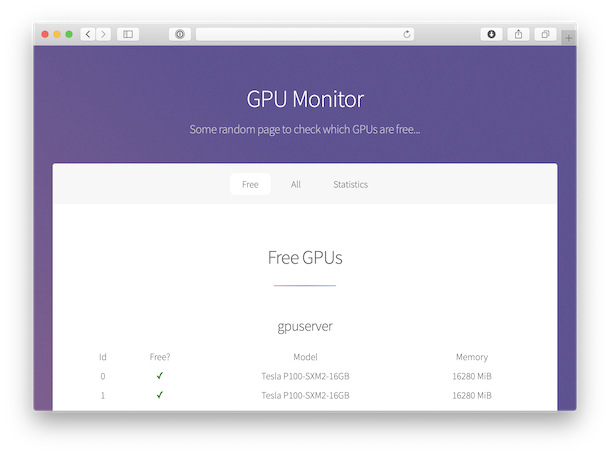

# GPU Monitor

Fun thing to watch gpu usage on cluster. Flask-based webapp to show GPU occupation and usage statistics collected via SSH and nvidia-smi.



## Usage
First, adapt `config.py`.

Run either with your username and password:
```
export GPUMONITOR_USER='<your_user>'
export GPUMONITOR_PASS='<your_password>'

python -u server.py
```

or with a private key:
```
export GPUMONITOR_USER='<your_user>'
export GPUMONITOR_PASS='<private_key_passphrase>'

python -u server.py
```

And navigate to your hosted web-app :)

## Notes
We currently assume single processes per GPU for display purposes.

## Requirements
It needs
```
flask
lxml
paramiko
pandas
```

## Acknowledgements
This uses some adapted templates from html5up.